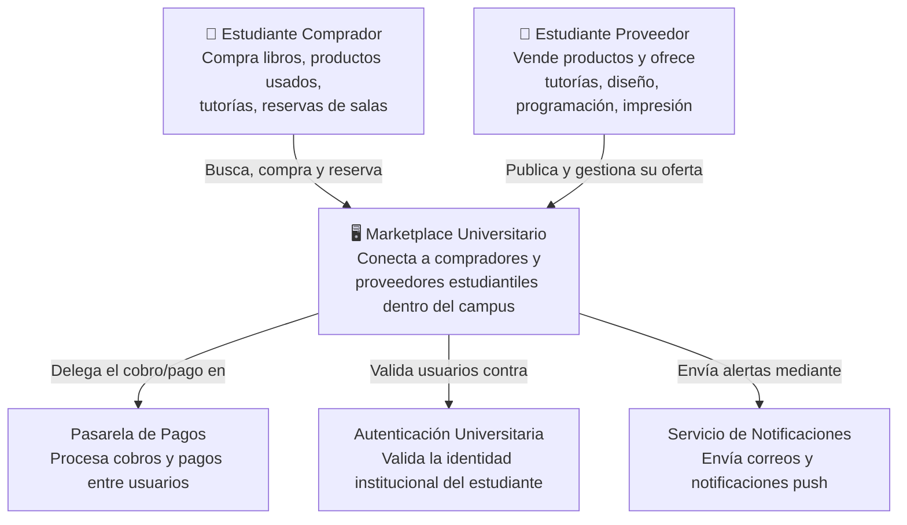
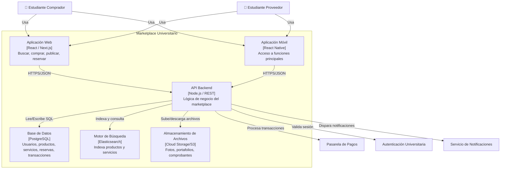
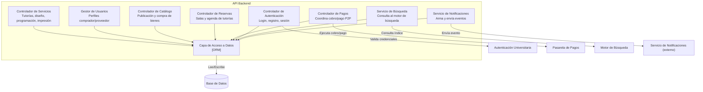
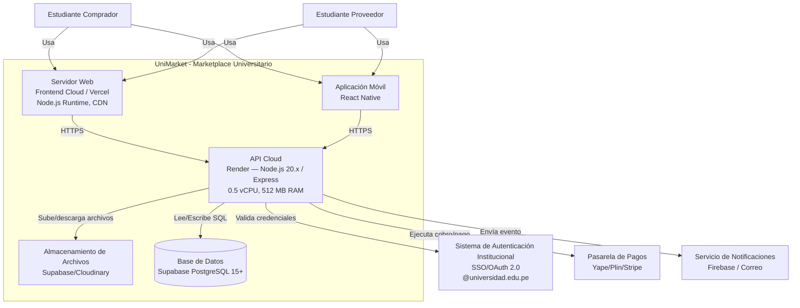
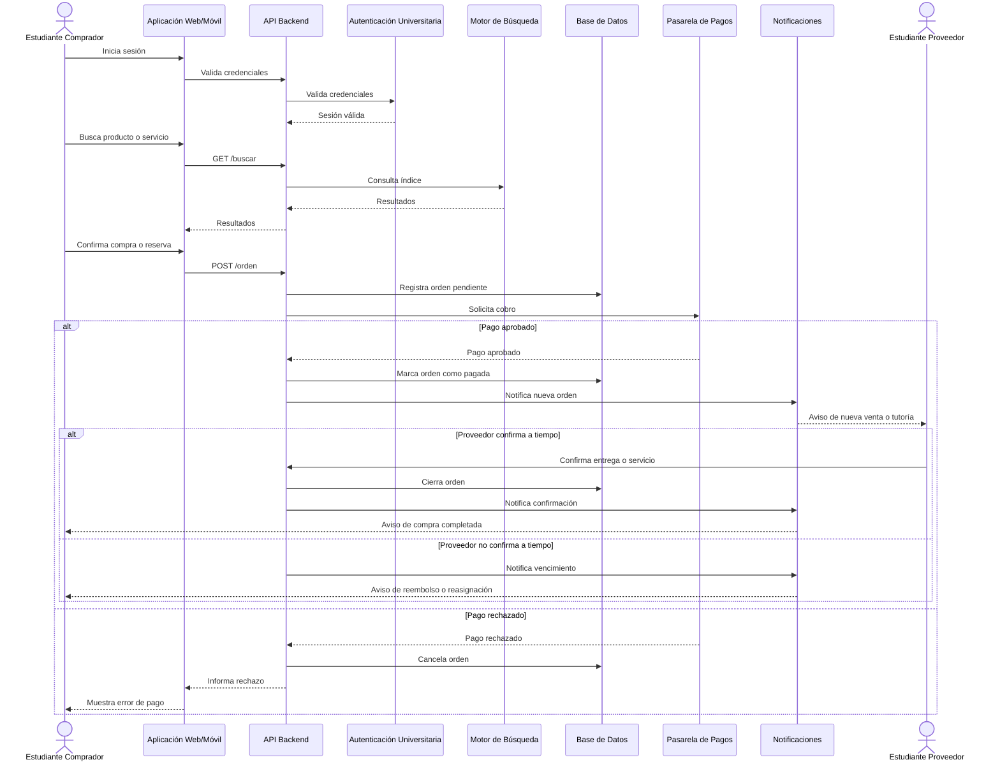

**ARQUITECTURA C4**

**1. Diagrama de contexto**

**2. Diagrama de contenedores**

**3. Diagrama de componentes (API Backend)**

**4. Arquitectura técnica (con presupuesto optimizado)**

**5. Diagrama de secuencia (compra/reserva)**
