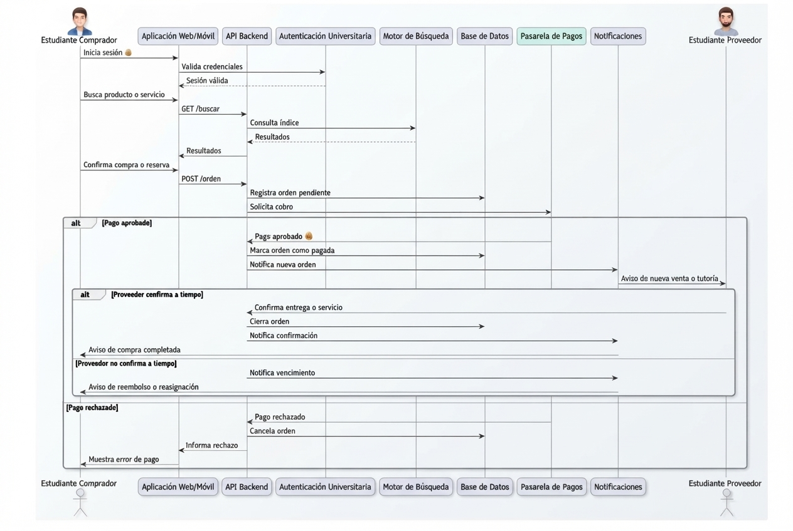

# Arquitectura inicial del sistema — UniMarket

## Diagrama de contexto

## Diagrama de contenedores

## Diagrama de componentes (API Backend)

## Arquitectura técnica v2.0

## Diagrama de secuencia

## Descripción

UniMarket adopta una arquitectura de **monolito modular escalable**, con Cloudflare como capa perimetral (DNS, HTTPS/SSL-TLS, CDN y caché) y Supabase PostgreSQL como base de datos transaccional. El backend concentra la lógica de negocio en módulos separados por dominio (autenticación, catálogo, reservas, órdenes, notificaciones, administración y un asistente de IA opcional), lo que permite escalar horizontalmente ejecutando varias instancias del monolito sin necesidad de migrar a microservicios.