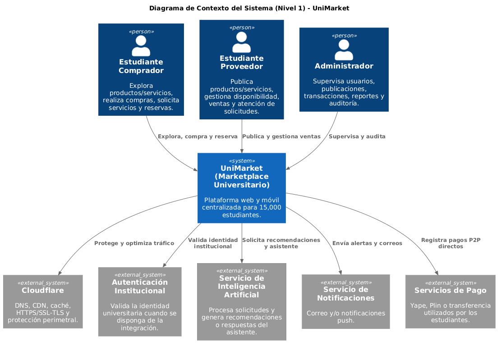
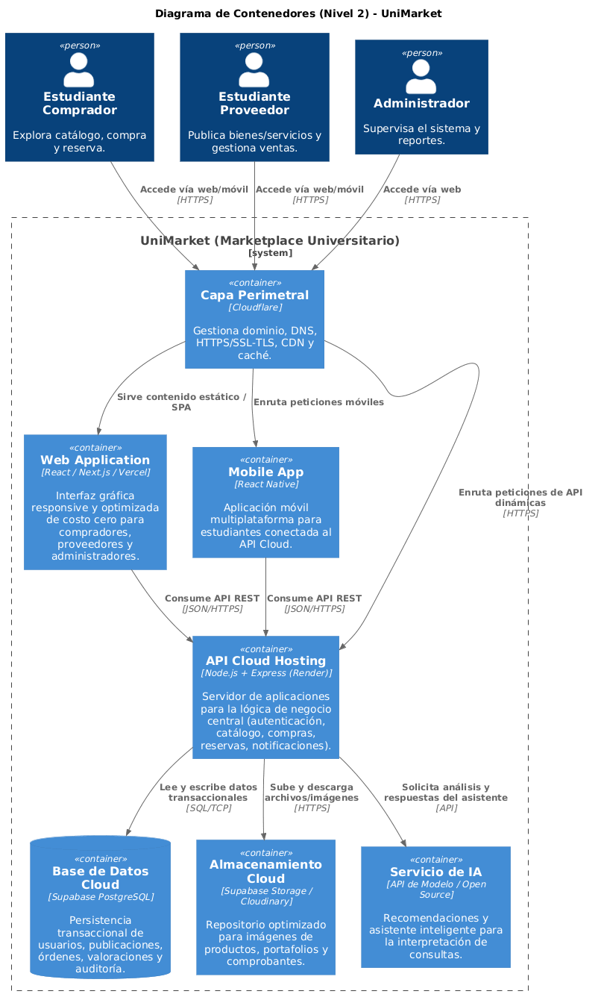
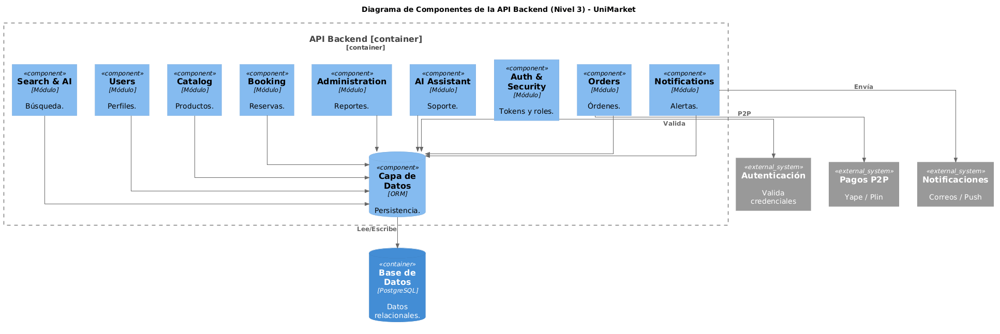
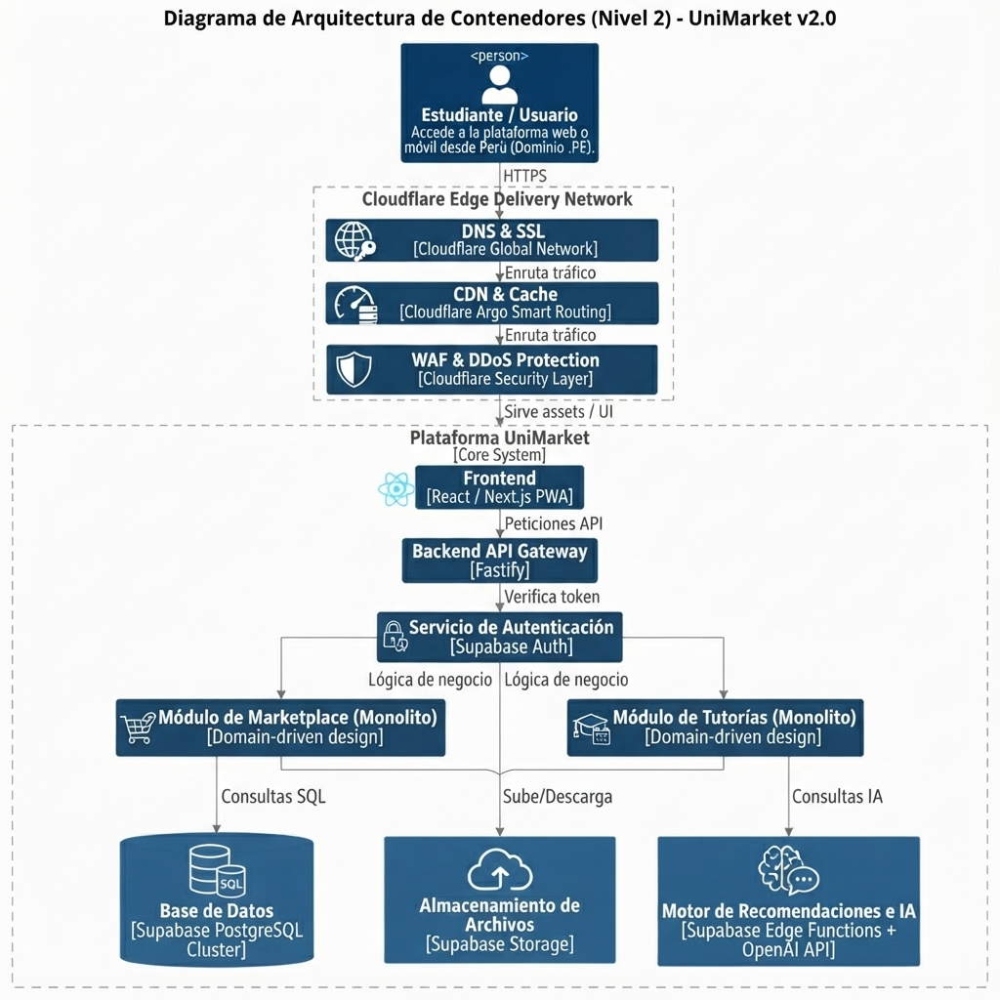
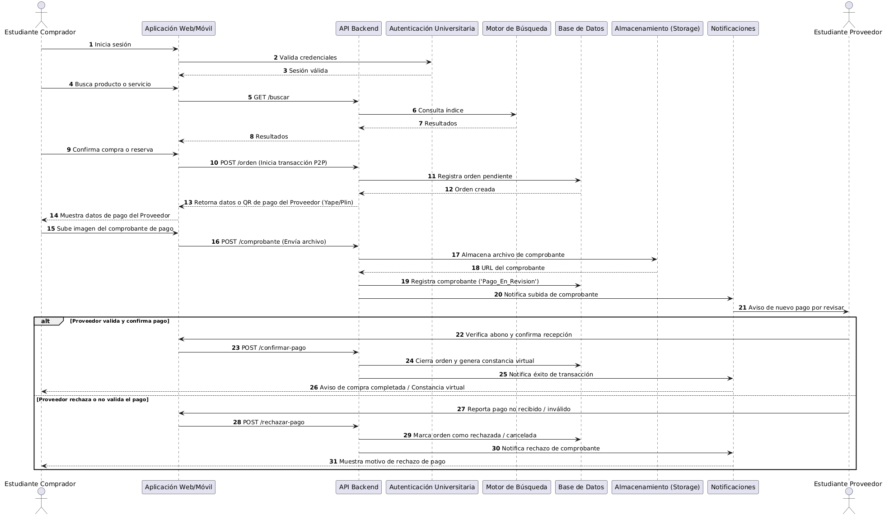

# Arquitectura inicial del sistema — UniMarket

## Diagrama de contexto

## Diagrama de contenedores

## Diagrama de componentes (API Backend)

## Arquitectura técnica v2.0

## Diagrama de secuencia

## Descripción

UniMarket adopta una arquitectura de **monolito modular escalable** bajo principios de Clean Architecture por dominio, con Cloudflare como capa perimetral (DNS, HTTPS/SSL-TLS, CDN y caché) y Supabase PostgreSQL como base de datos transaccional[cite: 18, 22]. El backend concentra la lógica de negocio en módulos separados (autenticación, catálogo, reservas, órdenes con soporte de pagos P2P y comprobantes, notificaciones, administración y un asistente de IA opcional), permitiendo trazabilidad de operaciones sin pasarelas de pago externas[cite: 16, 19, 20]. Esto facilita escalar horizontalmente ejecutando varias instancias del monolito según la demanda de los 15,000 estudiantes.