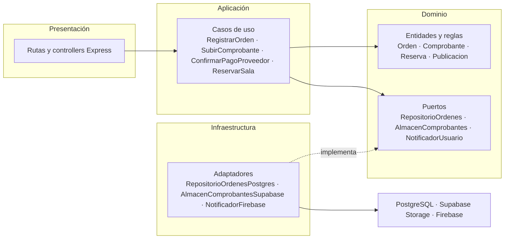

# Enfoque arquitectónico: Clean Architecture

| Elemento | Descripción aplicada a UniMarket |
|---|---|
| Patrón / enfoque arquitectónico | Clean Architecture (Arquitectura Limpia), aplicada dentro de cada módulo del backend. |
| Objetivo | Separar responsabilidades y controlar las dependencias hacia el dominio. |
| ¿Qué problema resuelve? | Evita que las reglas de órdenes, reservas y publicaciones dependan de Express, PostgreSQL, Supabase Storage, Supabase Auth o servicios de notificación e IA. |
| Capas definidas | Presentación, Aplicación, Dominio e Infraestructura. |
| Beneficios | Facilita el mantenimiento y las pruebas unitarias. Permite cambiar implementaciones técnicas sin modificar innecesariamente las reglas del negocio. Mejora la organización y separación de responsabilidades del código. |

## Organización de las capas por módulo
Ejemplo con el módulo Orders & Transactions:

| Capa | Carpeta | Contenido |
|---|---|---|
| Dominio | `dominio/` | Entidades `Orden`, `Comprobante`, `Constancia`, y puertos `RepositorioOrdenes`, `AlmacenComprobantes`, `NotificadorUsuario`. Regla: una orden solo pasa a confirmada si el proveedor valida el comprobante. |
| Aplicación | `aplicacion/` | Casos de uso `RegistrarOrden`, `SubirComprobante`, `ConfirmarPagoProveedor`. |
| Infraestructura | `infraestructura/` | Adaptadores `RepositorioOrdenesPostgres`, `AlmacenComprobantesSupabase`, `NotificadorFirebase`. |
| Presentación | `presentacion/` | Rutas y controllers Express que invocan los casos de uso. |

El módulo Booking sigue la misma estructura, con la entidad `Reserva` y la regla de no cruce de horarios.

```
src/
  modules/
    ordenes/
      dominio/
      aplicacion/
      infraestructura/
      presentacion/
    reservas/ ...
    catalogo/ ...
  shared/
    composicion.ts   (elige qué adaptador cumple cada puerto)
```

## Regla de dependencia
1. El dominio no importa nada de las demás capas ni de Express, Supabase, PostgreSQL o Firebase.
2. Los casos de uso solo conocen entidades y puertos del dominio.
3. Los adaptadores de infraestructura implementan los puertos definidos en el dominio (inversión de dependencias).
4. Cambiar de tecnología implica cambiar el adaptador y su registro en la composición, no el dominio.

## Qué se hizo y decisión tomada
Se abrió y ejecutó el proyecto de ejemplo (Angular) y se auditó su estructura en `src/app/` sin desarrollar nada nuevo. Se comprobó que el dominio (`dominio/modelos` y `dominio/contratos`) solo importa archivos del propio dominio, sin Angular, HttpClient ni RxJS. Los casos de uso de `aplicacion/` importan únicamente entidades y contratos del dominio. Angular y HttpClient aparecen solo en `infraestructura/` (repositorios y notificadores) y en `presentacion/`, y `infraestructura/tokens.ts` y `app.config.ts` registran qué adaptador cumple cada contrato.

Con esa referencia se decidió aplicar **Clean Architecture dentro de cada módulo del backend de UniMarket** (ADR-002). La decisión responde al driver DA05 (mantenibilidad), porque permite cambiar una funcionalidad o un proveedor sin afectar al resto, y al driver DA03 (pagos P2P): el comprobante y las notificaciones pasan por puertos y no por servicios concretos. También da soporte a DA08, porque la IA queda detrás de un puerto opcional.

Se descartaron MVC simple y capas tradicionales porque acoplan la lógica a la base de datos y al framework. El costo es una estructura inicial con más carpetas e interfaces, que se compensa con las pruebas del dominio sin base de datos y la facilidad de cambio.

## Relación con el estilo arquitectónico
El estilo (monolito modular en capas, ver `../estilo-arquitectonico.md`) define cómo se organiza y despliega el sistema completo. Clean Architecture define cómo se organizan las dependencias dentro de cada módulo.

## Diagrama

