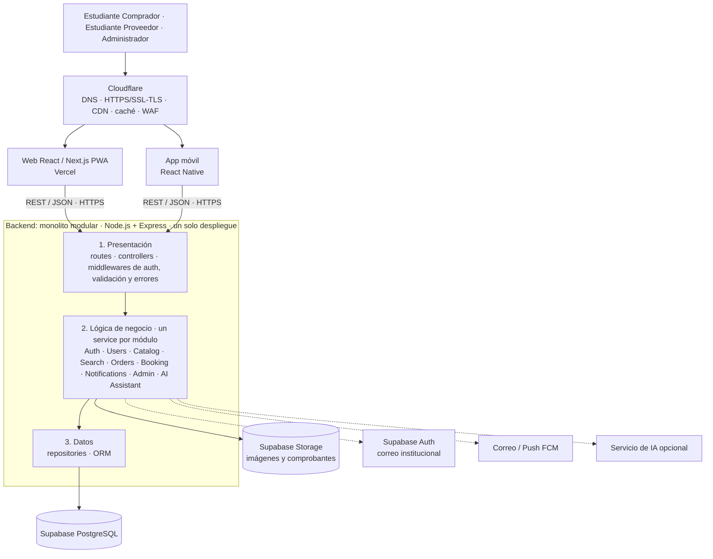

# Estilo arquitectónico - UniMarket

## Estilo seleccionado
**Monolito modular con arquitectura en capas** (presentación, lógica de negocio y datos). El backend (Node.js + Express) es una sola aplicación desplegable, dividida en módulos, con una sola base de datos PostgreSQL (Supabase). La web (React / Next.js PWA) y la app móvil (React Native) lo consumen mediante una API REST, con Cloudflare como capa perimetral.

Capas = organización lógica. Monolito = unidad de despliegue. Ambos conviven.

## Justificación
| Driver | Cómo responde el estilo |
|---|---|
| DA01 Presupuesto | Un solo despliegue en servicios PaaS con capa gratuita. |
| DA04 Escalabilidad | Backend stateless que se replica en varias instancias detrás de un balanceador. |
| DA05 Mantenibilidad | Un módulo por dominio, sin acceso directo entre repositorios. |
| DA06 Infraestructura perimetral | Cloudflare resuelve DNS, HTTPS, CDN, caché y WAF antes de llegar a la aplicación. |
| DA09 Rendimiento | Caché en el borde y en el backend, e índices en PostgreSQL. |
| DA10 API REST | Una API única para web y móvil. |

La propuesta descarta microservicios como arquitectura principal. La separación modular permite extraer un componente más adelante si hiciera falta.

## Módulos
Auth & Security, Users, Catalog, Search & Recommendations, Orders & Transactions, Booking & Schedule, Notifications, Administration & Reports y AI Assistant (opcional).

## Reglas del estilo
1. Cada capa solo invoca a la capa inmediatamente inferior.
2. Un módulo no accede al repositorio ni a las tablas de otro módulo.
3. La comunicación entre módulos se hace llamando al servicio del otro módulo.
4. Todo se ejecuta en un único proceso backend con una única base de datos.
5. Los servicios externos (Auth, notificaciones, IA, almacenamiento) se acceden desde la lógica de negocio mediante adaptadores.

## Despliegue
| Componente | Servicio |
|---|---|
| DNS, HTTPS, CDN, caché, WAF | Cloudflare, con dominio .PE |
| Web (React / Next.js PWA) | Vercel |
| Backend monolito modular | Render o Railway |
| Base de datos | Supabase PostgreSQL |
| Archivos (imágenes y comprobantes) | Supabase Storage |

## Diagrama

